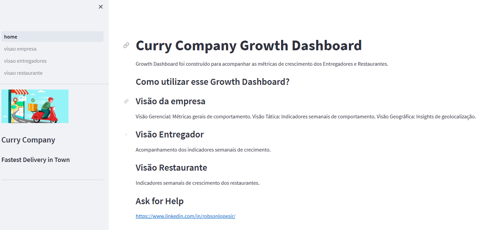

<h1 align="center"> Curry Company  </h1>

Projeto pessoal de Data Science para fins de estudo 

  <a href="#-tecnologias">Tecnologias</a>&nbsp;&nbsp;&nbsp;|&nbsp;&nbsp;&nbsp;
  <a href="#-projeto">Projeto</a>&nbsp;&nbsp;&nbsp;|&nbsp;&nbsp;&nbsp;
  <a href="#memo-licença">Licença</a>

  

## 🚀 Tecnologias

Esse projeto foi desenvolvido com as seguintes tecnologias:

- Python
- Streamlit
- Plotly

## 💻 Projeto

### 1. Problema de negócio

A Curry Company é uma empresa de tecnologia que criou um aplicativo que conecta restaurantes, entregadores e pessoas.

Através desse aplicativo, é possível realizar o pedido de uma refeição, em qualquer restaurante cadastrado, e recebê-lo no conforto da sua casa por um entregador também cadastrado no aplicativo da Curry Company.

A empresa realiza negócios entre restaurantes, entregadores e pessoas, e gera muitos dados sobre entregas, tipos de pedidos, condições climáticas, avaliação dos entregadores etc. Apesar da entrega estar crescendo, em termos de entregas, o CEO não tem visibilidade completa dos KPIs de crescimento da empresa.

Visando atender a necessidade da empresa, foi criado uma ferramenta onde foi possível organizar os KPIs em uma única ferramenta, para que o CEO possa consultar e conseguir tomar decisões simples. 

A Curry Company possui um modelo de negócio chamado Marketplace, que fazer o intermédio do negócio entre três clientes principais: Restaurantes, entregadores e pessoas compradoras. 

### 2. Perguntas do negócio

As questões a serem respondidas com a abordagem de Análise Exploratória de Dados - EDA são:

#### 2.1. Do lado da Empresa:
1. Quantidade de pedidos por dia.
2. Quantidade de pedidos por semana.
3. Distribuição dos pedidos por tipo de tráfego.
4. Comparação do volume de pedidos por cidade e tipo de tráfego.
5. A quantidade de pedidos por entregador por semana.
6. A localização central de cada cidade por tipo de tráfego.

#### 2.2. Do lado dos entregadores
1. A menor e maior idade dos entregadores.
2. A pior e a melhor condição de veículos.
3. A avaliação médida por entregador.
4. A avaliação média e o desvio padrão por tipo de tráfego.
5. A avaliação média e o desvio padrão por condições climáticas.
6. Os 10 entregadores mais rápidos por cidade.
7. Os 10 entregadores mais lentos por cidade.

#### 2.3. Do lado dos Restaurantes
1. A quantidade de entregadores únicos.
2. A distância média dos restaurantes e dos locais de entrega.
3. O tempo médio e o desvio padrão de entrega por cidade.
4. O tempo médio e o desvio padrão de entrega por cidade e tipo de pedido.
5. O tempo médio e o desvio padrão de entrega por cidade e tipo de tráfego.
6. O tempo médio de entrega durantes os Festivais.

### 3. Premissas do Negócio

•	Os valores 'NaN' encontrados nas colunas foram removidos;

•	Foram encontrados e retirados espaçamentos do dataset, espaçamentos estes que prejudicariam as nossas análises;

•	Não foi possível, com as informações disponíveis, o estabelecimento de critérios que, de forma eficiente, nos desse uma posição exata dos melhores e piores entregadores;

•	As condições do trânsito, bem como o tipo de veículo são decisivos para a velocidade da entrega. Contudo, não é possível, com as informações disponíveis, o estabelecimento de critérios eficientes para sabermos a real situação da relação acima estabelecida entre tipo de veículo, distância e condição climática.

### 4. Estratégia da solução

1.	Coleta de dados via Kaggle
2.	Entendimento de negócio
3.	Tratamento de dados
3.1.  Transformação de variáveis
3.2.  Limpeza
3.3.  Entendimento
4.	Exploração de dados
5.	Responder problemas do negócio
6.	Conclusão

### 5. Produto final:

Painel online, hospedando em Cloud e disponível para acesso em qualquer dispositivo conectado à internet.

O painel pode ser acessado através do link: https://curry-company-delivery.streamlit.app/

### 6. Conclusão

O objetivo desse projeto foi criar um conjunto de gráficos e tabelas que exibam essas métricas da melhor forma possível para o CEO.

Da visão da Empresa, podemos concluir que o número de pedidos cresceu entre a semana 06 e a semana 13 do ano de 2022.

## :memo: Licença

Esse projeto está sob a licença GNU.

---

Feito com ♥ by Robson :wave: [Contato](https://www.linkedin.com/in/robsonlopesjr/)